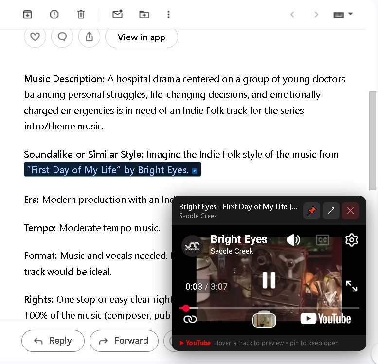

Sync Brief Reference Track Player (Chrome extension for gmail)
by pftq

Handy tool for playing the reference track automatically on sync brief emails.

Install instructions:
1. Go to chrome://extensions  
2. Enable Developer mode
3. Click Load unpacked
4. Select this folder

This tool is originally targetted for emails from The Sync Opps but can be customized to any format if you adjust the REGEX patterns in the patterns.txt file. The first capture group is searched on YouTube. If a second capture group exists, it is treated as the artist name and appended to the search.

